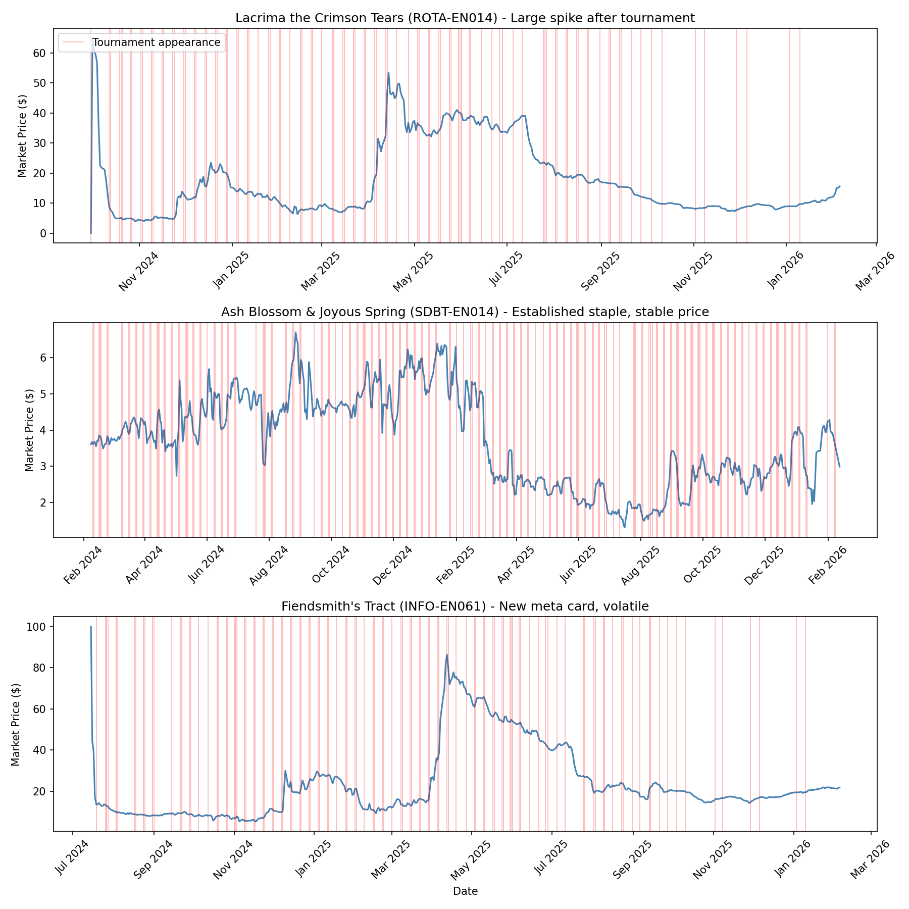
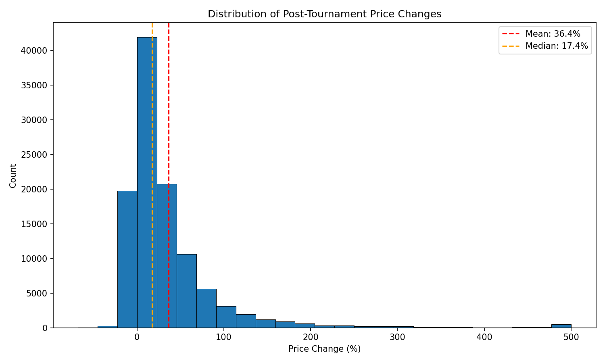
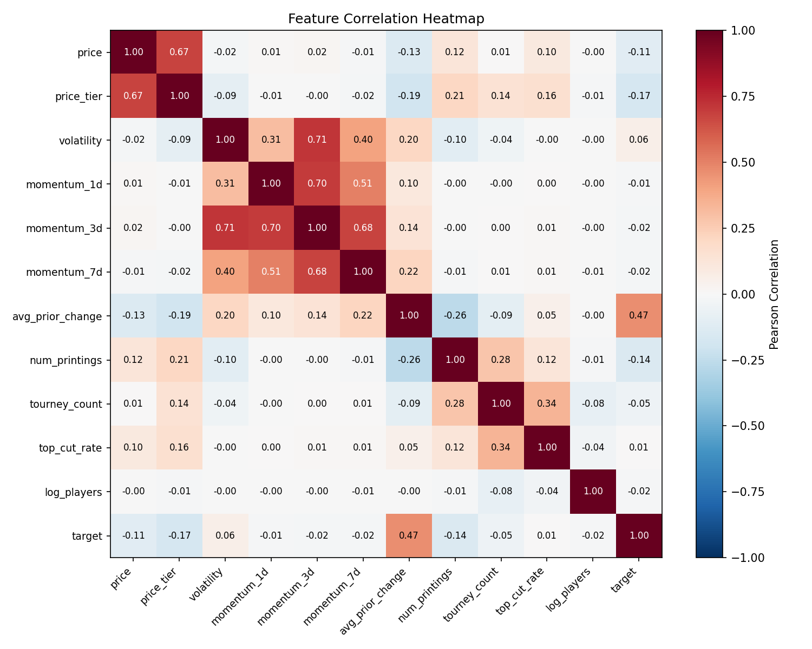
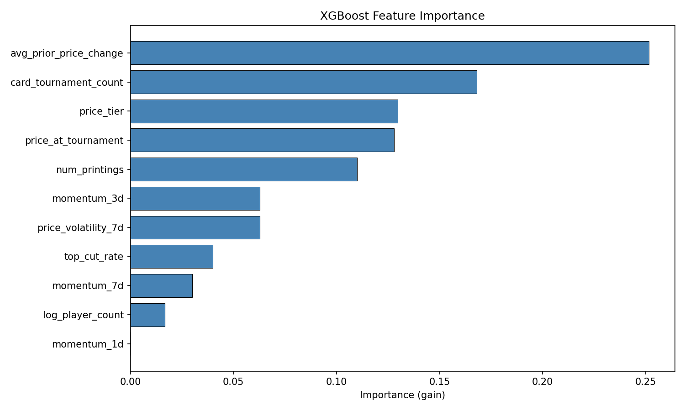
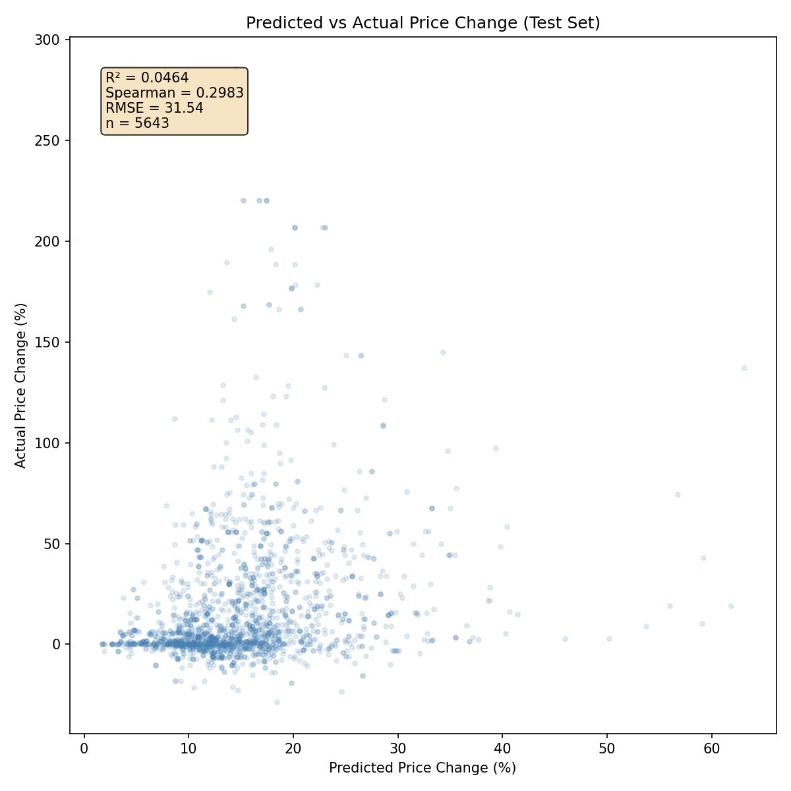
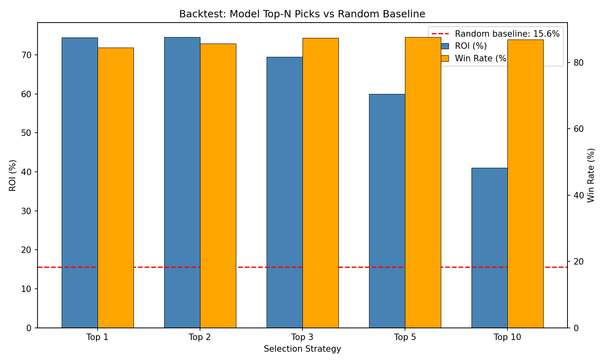
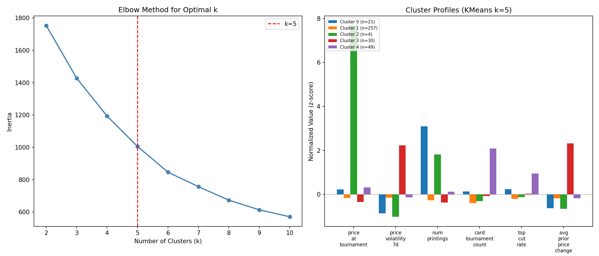

# Predicting Changes in Yu-Gi-Oh Card Price Based on Tournament Results

## Video Walkthrough

[](https://youtu.be/LH5NC1mjB6k)

## How to Build and Run

### Prerequisites
- Docker Desktop
- Python 3.11+
- Node 20+ (only if running the frontend)

### Quick start

```bash
cp .env.example .env   # DB credentials (port 5433, password "postgres")
docker compose up -d   # boot the seeded database
make install           # pip install -r requirements.txt
make test              # 16 unit tests
```

If the tests pass, the pipeline is wired up correctly. The seed database
auto-loads ~7.7M market snapshots, ~40K deck profiles, ~4.4K tournaments,
all banlists, and historical paper-trader runs — **no scraping or API
calls required**.

### Full pipeline

```bash
make train          # train buy model
make train-sell     # train sell-timing model (requires buy model)
make paper-trade    # replay history with quarterly retraining
```

Each step writes its outputs to disk or the database:
- `make train` → `models/price_predictor.joblib`
- `make train-sell` → `models/sell_model.joblib`
- `make paper-trade` → rows in `paper_positions` and `paper_trades_log`
  under `strategy_id='default'`

### Frontend dashboard (optional)

```bash
cd frontend
cp .env.example .env.local   # DB credentials for the Next.js dev server
npm install
npm run dev
```

Then open <http://localhost:3000>. Pages:
- `/trading` — paper trader P&L, open positions, closed trades
- `/cooccurrence` — search a card, see its top deck-mates
- `/clustering`, `/report`, `/ml` — feature exploration and model metrics

### Visualizations from disk

```bash
make viz   # generates static plots from models/*.json
```

## Description
This project takes a deeper look into the trading card game Yu-Gi-Oh and the card market built around it. When a deck archetype (A group of cards specifically designed to work together) performs well at a major tournament, demand for its best and rarest cards spikes, often causing significant price movement on online marketplaces like TCGPlayer. Similarly, archetypes which perform badly will often see significant dips in price.

This project is driven by an interest in quantitative finance and exploring if tactics typically utilized in traditional financial markets, like the stock market, may be applied to a less efficient market like the one for Yu-Gi-Oh cards. The Yu-Gi-Oh card market is in many ways similar to traditional financial markets however, it operates on a smaller scale with less competition. This project aims to exploit the smaller scale of the market in order to find inefficiencies or patterns which could be used to predict price movements before the market is able to react, similar to how quantitative traders aim to identify and capitalize on mispricings in financial markets.

In order to achieve this, the plan is to build a pipeline that collects both tournament result data and historical card pricing data. Then, using machine learning, predict whether a card's price will increase, decrease, or remain the same in the days following a major tournament. The goal is to find predictive signals for card movements from the decklists that perform the best in tournaments. Currently, the project will be considered successful by achieving an accuracy of at least 70% when predicting a cards price direction and magnitude, however this is subject to change as the project develops and the data becomes better understood.

The initial modeling will explore classification methods such as logistic regression and decision trees, potentially progressing to more advanced methods like XGBoost. The data will be split using a train/test approach, where earlier tournament data is used for training while the most recent events are reserved for testing. Visualizations will include price trajectory plots as well as feature importance charts to highlight which tournament metrics are the strongest predictors of price movement.

If predicting both the direction and magnitude of price changes becomes impossible within the timeframe, the project will fall back to predicting whether a card's price will go up or down following a tournament. This simplifies the problem making it easier to collect labeled training data and evaluate model performance with standard metrics. Another potential fallback plan would be to narrow the scope to a single popular archetype or a small set of cards.

### What was built

The system has two ML models:

1. **Buy model** — XGBoost regressor, ensemble of 5 with different seeds, log-transformed target. Predicts the percent price change of a card in the 60 days following a tournament appearance. Uses 22 features grouped into momentum, peak-distance, archetype, banlist status, and deck-mate co-occurrence. Trained with a strict chronological 70/15/15 split — no random k-fold.

2. **Sell-timing model** — XGBoost binary classifier. For an open position, predicts SELL vs HOLD on each day given features like `peak_gain_pct`, `drawdown_from_peak_pct`, `days_held`, and recent momentum. Label is 1 when the spike is over (run-up over 15%, momentum negative, no future recovery).

Both models are evaluated by a **paper trader replay** (`scripts/run_paper_trader.py`) that walks tournaments chronologically, retrains both models every 90 days, applies them to make BUY and SELL decisions, and records the resulting positions and P&L to the database. Retraining mid-replay keeps each prediction grounded only in data available at that point — no leakage.

The regressor's R² is intentionally not the headline metric: card-price spikes are a noisy target, so what matters is ranking quality(Spearman correlation) and the realized ROI of the Top-N pick strategies in the paper trader, not the absolute fit. See the Results section.

## Project Timeline
Week 1–2: Begin by setting up the data collection pipeline by connecting to the YGOProDeck API for the necessary tournament data, then pull from the TCGPlayer website to get pricing/sales data. Begin the initial data cleaning.

Week 3–4: Clean and merge tournament and pricing datasets. Begin feature engineering and create preliminary visualizations.

Week 5–6: Begin data analysis and initial modeling. Train classifiers, iterate through and test on the feature selection, and begin to generate preliminary results.

Week 7: Evaluate model performance, refine models, and build final visualizations. Set up GitHub workflow, Makefile, and test code.

Week 8: After ensuring all the code is reproducible, finalize visualizations, README, and presentation.
## Goals
The goal of this project is to successfully predict the direction and approximate magnitude of Yu-Gi-Oh card price changes (increase, decrease, stable) in the 1–15 day period following a major tournament, based on the top performing decklist data. Beyond just predicting the prices, this project will aim to identify which features of tournament performance are the biggest drivers of price movements, such as the number of top cut appearances, the win rate of specific cards or archetypes, or diversity of the decks the card appears in. Finally, this project will aim to produce data visualizations of the prediction model, in order to visualize the relationship between tournament results and subsequent price shifts, enabling users to explore trends across different events and card archetypes.
## Data Collection Plan
This project will require two main categories of data: card pricing data, and tournament result data.

Within the United States as well as Europe, the most popular website to buy and sell Yu-Gi-Oh cards is the website TCGPlayer. Throughout the project this website will be utilised through web scraping as well as their API in order to collect daily market prices and price trends for cards that are featured in the top cut of tournaments. If the TCGPlayer website proves to be insufficient for data collection, existing kaggle data sets could be used to fill gaps. Potentially adding pricing data from other popular Yu-Gi-Oh card markets such as Ebay and Amazon could be a way to ensure that enough data is gathered.

In order to gather the necessary data from tournaments we will be using YGOProDeck public API, which provides card metadata (name, type, archetype, number of copies) as well as tournament decklist information. This API will be used to collect top-cut decklists from major events such as YCS tournaments, Regional Championships, and National Championships.

## Data Cleaning

Raw data lives in PostgreSQL across five tables (`tournaments`,
`deck_profiles`, `cards`, `printings`, `market_snapshots`). Cleaning happens
inside `data_processing/extract.py` before the model ever sees a row.

**Filtering** (`config.py`):
- Cards must appear in at least `MIN_CARD_APPEARANCES = 10` tournaments to
  be kept. Below that the per-card cumulative features are too noisy.
- Cards must be priced at or above `MIN_CARD_PRICE = $3.00`. Cheaper cards
  are dominated by TCGPlayer's flat $0.30 transaction fee, so even a 50%
  predicted spike can lose money after fees.
- Tournaments must be in the TCG format with `player_count > 0`. Other
  formats (OCG, GOAT, etc.) have different metas and prices.

**Deduplication.** Multiple printings of the same card in the same
tournament (different sets, rarities, etc.) collapse to a single row keyed
on `(tournament_id, product_id, event_date)`. The `ranked_printings` CTE
picks the printing with the most market-snapshot rows, so we always model
the most-traded version.

**Temporal split.** Data is sorted by `event_date` and split chronologically:
70% train / 15% validation / 15% test. Random k-fold is intentionally not
used — it would leak future tournament results into training and silently
inflate accuracy.

**Banlist alignment.** For each tournament, we resolve the active banlist
as of `event_date` (binary search over banlist effective dates) and join it
to compute `banlist_status`, `is_banned`, and `days_since_ban_change`.
Cards on the active banlist behave very differently from unrestricted cards.

**Sparse-snapshot tolerance.** Market snapshots are not evenly spaced
(daily after Feb 2024, monthly before via PriceCharting backfill). The
LATERAL JOINs in `data_processing/queries.py` use widened time windows
(e.g. "1-4 days before" instead of "exactly 1 day before") so the query
still returns a value when the exact day is missing. The `is_monthly_data`
feature flags pre-2024 rows so the model can learn to weight them differently.

## Feature Extraction

The buy model uses 22 features in `config.FEATURES`, grouped into six families.
All computed in `data_processing/extract.py` and `queries.py`.

### Price level (3)
- `price_at_tournament` — closest market snapshot to `event_date` (31-day
  lookback window).
- `price_tier` — bucketed price level (1-5).
- `price_volatility_7d` — std of the short-window momentum spread.

### Momentum (5)
`momentum_{1,3,7,30,90}d` — % price change over different lookback windows
before the tournament. Windows are widened (e.g. "1-4 days before") so the
LATERAL JOIN still finds a snapshot when the exact day is missing.

### Peak distance (6)
- `distance_from_high` / `is_new_high` — vs a peak back-calculated from
  momentum features.
- `distance_from_30d_high` / `is_new_30d_high` — vs `MAX(market_price)` over
  the 30 days before the tournament.
- `distance_from_60d_high` / `is_new_60d_high` — same, 60-day window.

### Tournament context (4)
- `archetype_avg_top_cut_rate` — mean historical top-8 rate across same-archetype
  cards at this tournament.
- `archetype_momentum_7d` — mean 7d momentum across same-archetype cards.
- `deck_trend` — current `decks_with_card` divided by the card's historical
  average.
- `deckmate_momentum_avg` — weighted average of deck-mates' momentum_7d,
  weighted by co-occurrence strength `P(deckmate | this card)`. Built from a
  card-card graph in `_build_cooccurrence_matrix`.

### Banlist (3)
- `banlist_status` — 0 (Unlimited) to 3 (Forbidden) as of `event_date`.
- `is_banned` — 1 if status > 0.
- `days_since_ban_change` — days since this card's status last changed.

### Era flag (1)
- `is_monthly_data` — 1.0 if pre-2024 (PriceCharting monthly era), else 0.0.

### Cumulative per-card history (saved with artifact, not in FEATURES)
Three lookup dicts saved in the model artifact for prediction-time use:
`card_avg_prior_price_changes`, `card_tournament_counts`, `card_top_cut_rates`,
plus `card_avg_decks` for `deck_trend`. All computed via grouped cumulative
transforms with `.shift(1)` so the current row's outcome can never leak into
its own features.

### Sell model features (10)
`config.SELL_FEATURES`, computed per open position per day in
`models/sell_model.py`: `peak_gain_pct`, `drawdown_from_peak_pct`,
`days_held`, `days_remaining`, `hold_pct_elapsed`, `price_momentum_3d/7d`,
`volatility_since_buy`, `predicted_change_pct`, `days_since_last_new_high`.

## Modeling

### Buy model (`models/train.py`)
- **XGBRegressor ensemble** of 5 with seeds 42-46, predictions averaged in
  log-space then inverse-transformed via `expm1`.
- **Target transform:** `log1p(y / 100)` on `price_change_pct`. Reduces
  right-skew and improves ranking quality.
- **Hyperparameter search:** two-stage random search optimizing Spearman
  (not RMSE) — Spearman matches the paper trader's actual decision criterion
  (rank-then-pick-top-N).
- **Split:** chronological 70 / 15 / 15 sorted by `event_date`. No random shuffle.
- All consumers (predict CLI, sell-model training, paper trader) call
  `models/predict_helpers.apply_buy_model` so the inverse transform is applied
  identically everywhere.

### Sell-timing model (`models/sell_model.py`)
- **XGBClassifier** trained on per-day position states.
- **Training data:** for each historical buy, walks the daily price curve from
  `market_snapshots` and emits one row per day with the 10 sell features and
  a binary label.
- **Label:** SELL = 1 when peak_gain > 15%, recent 3-day momentum is negative,
  AND the price never recovers above the current peak. Dips that bounce back
  are HOLD.
- **Class imbalance:** `scale_pos_weight` weights the minority SELL class.

### KMeans clustering (auxiliary)
k=5 on per-card profiles (`CLUSTER_FEATURES` in `config.py`), fit on the
training slice, saved with the artifact for the `/clustering` page. Removed
from the feature set after backtests showed it hurt ROI despite high
feature importance — kept in the artifact for visualization only.

### Data leakage prevention
Five rules enforced throughout the codebase:

1. **`ms_after` only in training queries.** Prediction query never reads
   future prices. Asserted in `tests/test_queries.py`.
2. **Cumulative features use `.shift(1)`** so a row never sees its own outcome.
3. **Chronological split** — data sorted by `event_date` before splitting,
   no random k-fold.
4. **Momentum windows are past-only** — every `momentum_*d` window ends
   before `event_date`.
5. **Periodic retraining respects cutoffs.** `scripts/run_paper_trader.py`
   retrains every 90 days using only data with `event_date <= yesterday`.
   Each retrain has its own `train_cutoff_date` saved in the artifact.

## Results

### Buy model

XGBoost regressor ensemble of 5, trained on 37,615 rows.

On the test split, RMSE is 31.5 (vs 40.4 train, 37.6 validation), MAE is
18.8 (17.6 train, 19.6 validation), and R² is 0.05 (0.23 train, 0.05
validation). Test **Spearman correlation is 0.30** (0.43 train, 0.24
validation), with average per-tournament Spearman of 0.28.

R² is intentionally not the headline — card-price spikes are noisy enough
that hitting exact percent changes is impossible, and what matters is
*ranking* cards correctly. Test Spearman of 0.30 is a moderate rank
correlation, and the rank-based backtest below confirms the ranking has
real economic value. The overfitting check fires (train-test R² gap of
0.18 versus a 0.10 threshold), but test RMSE is actually *lower* than
train RMSE — the gap reappeared because the `MIN_CARD_PRICE=$8` filter
cut training rows down. Flagging honestly.

Direction-of-change accuracy on the test set is **72.4%** — the model
correctly predicts whether a card will go up or down nearly three-quarters
of the time, even when the magnitude is off.

The top feature importances are `archetype_avg_top_cut_rate` (0.085),
`distance_from_high` (0.073), `momentum_90d` (0.065), `price_at_tournament`
(0.062), and `momentum_3d` (0.060). The non-tournament tail (`is_monthly_data`,
`momentum_1d`) came in at zero importance and is a candidate for pruning.

### Rank-based backtest (zero-fee, simulated)

For each of the 246 test tournaments, picking the top-N cards by model rating:

- **Top 1 per tournament** returned +29.9% ROI with an 86.2% win rate
  across 246 trades — a +14.7 percentage-point edge over the random
  baseline.
- **Top 2** returned +25.6% ROI (84.5% win rate, 491 trades, +11.7 pp).
- **Top 3** returned +25.0% (83.0%, 735 trades, +10.6 pp).
- **Top 5** returned +23.8% (81.2%, 1,223 trades, +9.4 pp).
- **Top 10** returned +20.4% (78.7%, 2,397 trades, +6.4 pp).

The random baseline (top-1 random pick per tournament, averaged over 20
trials) returned +13.0% ROI. **In a frictionless world, the ranking edge
is real** — the model beats random by ~15 percentage points at Top-1 and
the edge degrades cleanly as the pick set widens, which is the expected
shape of a working ranker.

### Sell-timing model

The sell classifier was trained on **2.39 million day-rows** generated from
37,615 historical buy positions, with class distribution 8.2% SELL /
91.8% HOLD. On the held-out test set (357,789 day-rows) at the default
0.5 probability threshold:

- **Overall accuracy: 99%**
- HOLD class: precision 1.00 / recall 0.99 / F1 0.99
- SELL class: precision 0.87 / recall 1.00 / F1 0.93

The top three feature importances are `peak_gain_pct` (0.43),
`price_momentum_3d` (0.39), and `predicted_change_pct` (0.10) — i.e. the
classifier learns to fire SELL when a position is well into profit AND
recent momentum has turned over. The classification metrics are strong;
how much of that quality survives realistic sell timing in the paper
trader is the question the next section answers.

### Paper trader replay

The replay walks every tournament between the buy model's training cutoff
(2025-07-25) and the latest seeded data (2026-04-12), retrains both
models every 90 days, and applies them to make BUY and SELL decisions.
It picks the single highest-confidence card per tournament and skips
cards already held within the last 7 days. In one pass the script writes
two parallel strategies: one with TCGPlayer's full fee schedule applied
(default), and one with fees zeroed out (default_nofee), so the cost of
fees alone can be isolated from the model's underlying edge.

With fees applied, the replay closed 133 positions, deployed $2,082.45,
and ended with a realized P&L of −$259.32 — an ROI of −12.45% on deployed
capital and a win rate of 43.6%.

Without fees, the same replay closed 141 positions, deployed $2,194.14,
and ended with a realized P&L of +$64.27 — an ROI of +2.93% on deployed
capital and a win rate of 55.3%.

The ~15 percentage-point gap between the two is the cost of fees alone
on this trade size. The model's ranking edge is real — the no-fee run
converts it to positive P&L with a 55% win rate — but at $8 cards
TCGPlayer's flat $0.30 fee plus 13.25% commission eats enough small
wins to push the realistic run negative.

## Visualizations

### Price Trajectories Around Tournaments

Daily prices for three cards showing clear price spikes following tournament appearances. Mementoal Tecuhtlica went from $3.55 to $39.85 after March 2025 tournaments, Vanquish Soul Razen spiked from $3.62 to $29.10 in January 2026, and Secreterion Dragon climbed from $7.55 to $29.04.

### Target Distribution

Distribution of post-tournament price changes showing a heavy right skew (median 6.9%, mean 18.3%, std 46.0%). The skew motivates the `log1p(y/100)` target transform used during training.

### Feature Correlation Heatmap

Pearson correlation between features and the target, showing avg_prior_price_change (0.47) as the strongest linear predictor.

### Feature Importance

XGBoost feature importance averaged across the 5-model ensemble. The top three (`archetype_avg_top_cut_rate`, `distance_from_high`, `momentum_90d`) sum to ~22% of total importance — no single feature dominates, and the model reads broadly across momentum, peak-distance, and archetype signals. `is_monthly_data` and `momentum_1d` come in at zero importance and are pruning candidates.

### Predicted vs Actual

Test set predictions vs actuals (5,643 samples). R² is low (0.05) — exact percent-change values are noisy — but Spearman ranking correlation is moderate (0.30), and the rank-based backtest shows that ranking translates into real economic edge.

### Backtest: Model vs Random Baseline

Zero-fee rank-based backtest across 246 test tournaments. The model's top pick per tournament returns +29.9% ROI versus +13.0% for the random baseline (averaged over 20 trials) — a +14.7 percentage-point edge. Win rates stay above 78% for Top 1-10 strategies and degrade cleanly as the pick set widens, the expected shape of a working ranker.

### KMeans Cluster Analysis

KMeans (k=5) clustering on per-card profiles built from 6 features (price, volatility, num_printings, tournament_count, top_cut_rate, avg_prior_price_change), standardized with z-score normalization. k=5 chosen via the elbow method. The five resulting clusters (over 2,625 cards in the training slice):

- **Cluster 0 (343 cards)** — cheap cards (~$1.65) with frequent tournament appearances and a high prior price-change average (+81%). Highly volatile, often spike candidates.
- **Cluster 1 (10 cards)** — ultra-rare chase cards (~$285 avg) with low tournament relevance.
- **Cluster 2 (708 cards)** — cheap cards that essentially never appear in tournaments. Background noise of the dataset.
- **Cluster 3 (1,442 cards)** — the bulk: mid-cheap cards (~$4) with moderate tournament participation and a +20% historical change average. The fat middle of the distribution.
- **Cluster 4 (122 cards)** — meta-defining staples (~$11 avg, 374 prior tournaments, 88% top-cut rate, +31% mean change). The most predictable spike candidates.

The cluster IDs are saved with the buy model artifact and used to assign cluster membership to unseen cards at prediction time. Clustering was kept for visualization only — adding the cluster ID as a feature actually hurt backtest ROI in earlier experiments.

## Tests + CI

The `tests/` directory contains pytest unit tests covering the highest-value
invariants in the codebase. Run them locally with `make test`. There are
16 tests across three files:

- **`test_queries.py`** — asserts `ms_after` (post-tournament price) appears
  in the training query but **never** in the prediction query, and that
  parameter substitution works. This is the data-leakage guardrail in test
  form.
- **`test_extract.py`** — feeds `_apply_feature_engineering` and
  `_apply_archetype_features` synthetic dataframes and asserts every
  feature in `config.FEATURES` is actually produced by the pipeline. Also
  checks the cooccurrence helper handles empty matrices correctly.
- **`test_config.py`** — asserts `FEATURES` has 22 unique entries and that
  the target column `price_change_pct` is never in the feature list.

The tests do not require a live database — they run against synthetic
data and pure functions, so they are safe to run in CI on every push.

`.github/workflows/test.yml` runs `make test` on every push and pull
request to `main` using Python 3.11.
